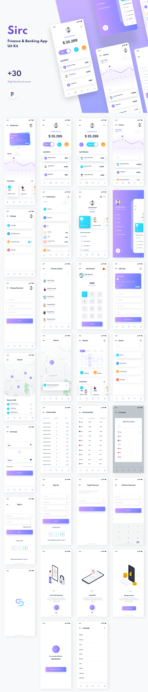

# sirc

A Finance Mobile Banking App.

You can use this app online at [xiaoyong.ml/SircApp/](https://xiaoyong.ml/SircApp/).

App Sketch and Design:

## Getting Started

To learn how to build this app by yourself, follow the steps below:

1. Clone the repository.
2. Install the flutter dependencies.
3. Build the app.
4. Run the app.

For more information, please refer to the [official guideline](https://docs.flutter.dev/deployment/android#build-an-apk)

